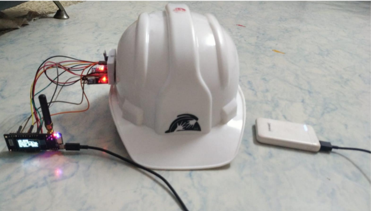
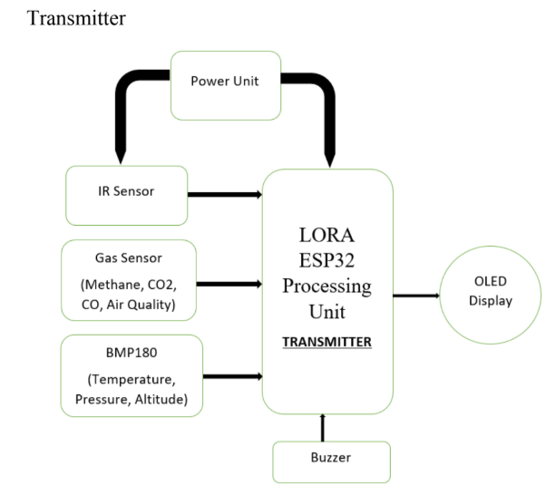
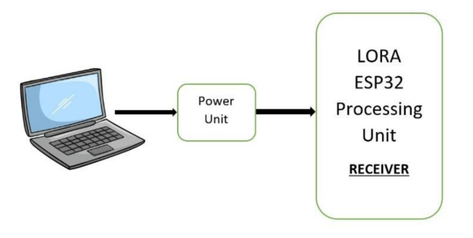
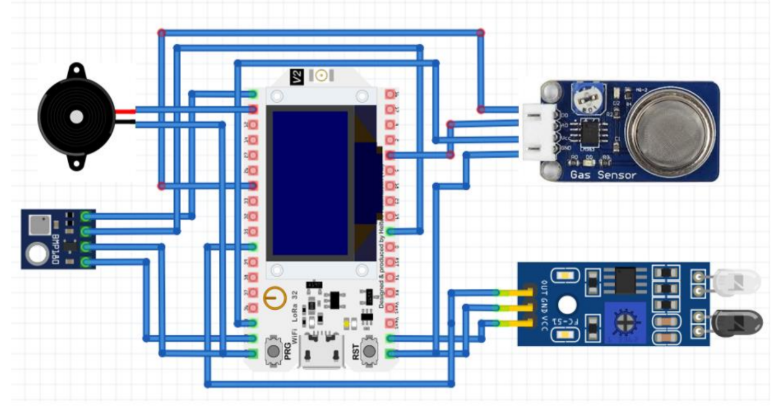
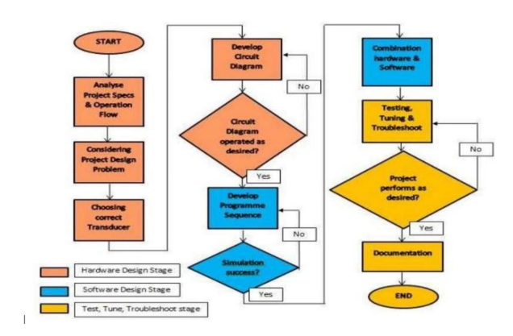

# Smart-Mining-Helmet-Industrial-IoT
**Real-time Safety Monitoring System for Underground Coal Miners**

---

## Project Overview

A **LoRa-ESP32 based intelligent safety helmet** designed to enhance miner safety in hazardous underground environments. This system continuously monitors critical environmental parameters and miner behavior, sending real-time alerts to a central control room via long-range LoRa communication.

---

## Key Features

| Feature | Description |
|-------|-----------|
| **Hazardous Gas Detection** | Detects **CO, CH₄ (Methane), LPG, NH₃, Benzene & Smoke** using MQ-135 / MQ-6 sensors |
| **Environmental Monitoring** | Measures **temperature & atmospheric pressure** using BMP-180 sensor |
| **Helmet Removal Detection** | IR-based switch alerts if the helmet is removed |
| **Emergency Audio-Visual Alert** | On-board **buzzer & LED** activate on danger thresholds |
| **Long-Range Wireless Communication** | **LoRa (433/868/915 MHz)** transmits data up to **1+ km** underground |
| **Base Station Dashboard** | Real-time data display at control room (via serial/OLED/web) |
| **GPS Location Tracking** *(Optional)* | Tracks miner position during emergencies |

## System Architecture
## Block Diagram

---

## Circuit & Flow

---

## Why This Project?

- **One miner dies every 3 days in India** (DGMS Report)
- **China**: 80% of global mining deaths despite 40% coal output
- **Chasnala Disaster (1975)**: 372 lives lost due to flooding & gas
- Traditional helmets **only protect the head**, not the life

> **This smart helmet doesn’t just protect — it predicts, alerts, and saves.**

---

## Applications

- Coal & metal mining
- Tunnel construction
- Confined space operations
- Industrial safety compliance

---

## Hardware Components

| Component | Function |
|---------|---------|
| TTGO LoRa ESP32 OLED | Microcontroller + LoRa transceiver + display |
| MQ-135 / MQ-6 | Multi-gas detection (CO, CH₄, LPG, etc.) |
| BMP-180 | High-precision temperature & pressure sensor |
| IR Switch | Detects if helmet is worn |
| Piezo Buzzer | Audible emergency alert |
| Status LED | Visual alert indicator |
| 18650 Li-ion Battery | Portable power supply |

> Full Bill of Materials (BOM) → `hardware/bom.xlsx`

---

## Safety Alerts Triggered

| Condition | Action |
|--------|-------|
| Gas > Threshold | `"GAS DETECTED"` + Buzzer ON |
| Temp > 45°C | `"HIGH TEMPERATURE"` + Alert |
| Helmet Removed | `"HELMET NOT WORN"` + LED Blink |
| Miner Collapse (IR + No Movement) | Emergency SOS to base |

---

## Research & Motivation

- **ILO Report**: Mining = 1% workforce, 8% fatal accidents
- **India**: 100+ deaths annually in coal mines
- Lack of **real-time monitoring** and **communication** in deep mines

→ This project bridges the gap with **IoT + LoRa** for **zero-delay alerts**.

---

## Future Enhancements

- Oxygen level monitoring (MH-Z19)
- Heart rate & fall detection (MAX30102 + MPU6050)
- Mesh LoRa network for multi-miner tracking
- Mobile app for supervisors
- AI-based anomaly prediction

---

## License

[MIT License](LICENSE) – Free to use, modify, and distribute.

---
**Saving one miner = saving a family. Let’s build safer mines.**
---

## System Architecture
